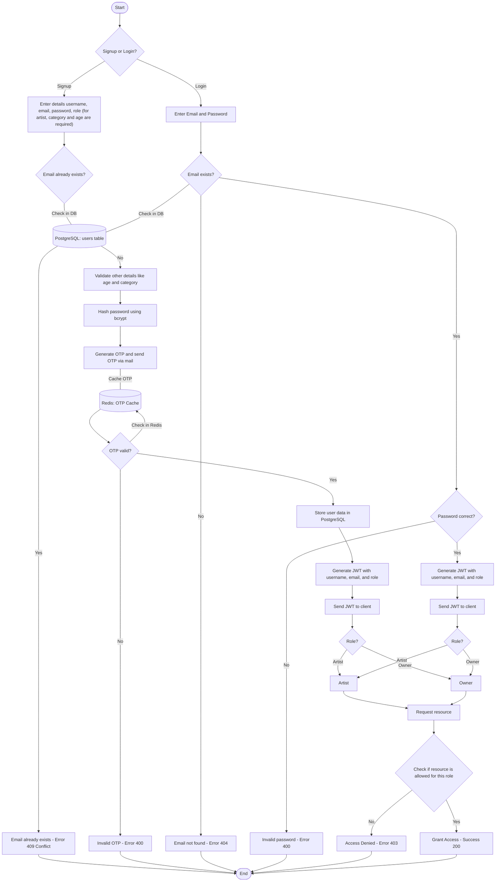

### Authentication and Authorization Diagram 

```mermaid

%% flowchart TD

%% %% ------------------ START POINT ------------------
%% A([Start])

%% %% ------------------ AUTH ENTRY ------------------
%% A --> B{"Signup or Login?"}

%% %% ------------------ SIGNUP FLOW ------------------
%% B -->|Signup| C["Enter details username, email, password, role (for artist, category and age are required)"]
%% C --> D{"Email already exists?"}

%% %% DB CHECK ON RIGHT SIDE
%% D ---|Check in DB| DB[("PostgreSQL: users table")]
%% DB -->|"Yes"| E["Email already exists - Error 409 Conflict"]
%% DB -->|"No"| F["Validate other details like age and category"]

%% %% REST OF SIGNUP FLOW
%% F --> G["Hash password using bcrypt"]
%% G --> H["Generate OTP and send OTP via mail"]

%% %% REDIS OTP STORAGE ON RIGHT SIDE
%% H -->|Cache OTP| R[(Redis)]
%% R --> I{"OTP valid?"}
%% I -->|Check in Redis| R
%% I -->|"No"| J["Invalid OTP - Error 400"]
%% I -->|"Yes"| K["Store user data in PostgreSQL"]
%% K --> L["Generate JWT with username, email, and role"]
%% L --> M["Send JWT to client"]
%% M --> N{"Role?"}
%% N -->|"Artist"| O["Artist"]
%% N -->|"Owner"| P["Owner"]

%% %% ------------------ LOGIN FLOW ------------------
%% B -->|Login| Q["Enter Email and Password"]
%% Q --> R1{"Email exists?"}
%% R1 ---|Check in DB| DB
%% R1 -->|"No"| S["Email not found - 404"]
%% R1 -->|"Yes"| T{"Password correct?"}
%% T -->|"No"| U["Invalid password - Error 400"]
%% T -->|"Yes"| V["Generate JWT with username, email, and role"]
%% V --> W["Send JWT to client"]
%% W --> X{"Role?"}
%% X -->|"Artist"| O
%% X -->|"Owner"| P


%% %% ------------------ ROLE ACCESS / REQUEST FLOW ------------------
%% O --> Y["Request resource"]
%% P --> Y
%% Y --> Z{"Check if allowed for this role from jwt token"}
%% Z -->|"No"| AA["Access Denied - Error 403"]
%% Z -->|"Yes"| AB["Grant Access - Success 200"]


flowchart TD

%% ------------------ START POINT ------------------
A([Start])

%% ------------------ AUTH ENTRY ------------------
A --> B{"Signup or Login?"}

%% ------------------ SIGNUP FLOW ------------------
B -->|Signup| C["Enter details username, email, password, role (for artist, category and age are required)"]
C --> D{"Email already exists?"}

%% DB CHECK ON RIGHT SIDE
D ---|Check in DB| DB[("PostgreSQL: users table")]
DB -->|"Yes"| E["Email already exists - Error 409 Conflict"]
E --> AC([End])
DB -->|"No"| F["Validate other details like age and category"]

%% REST OF SIGNUP FLOW
F --> G["Hash password using bcrypt"]
G --> H["Generate OTP and send OTP via mail"]

%% REDIS OTP STORAGE ON RIGHT SIDE
H ---|Cache OTP| R[(Redis: OTP Cache)]
R --> I{"OTP valid?"}
I -->|Check in Redis| R
I -->|"No"| J["Invalid OTP - Error 400"]
J --> AC
I -->|"Yes"| K["Store user data in PostgreSQL"]
K --> L["Generate JWT with username, email, and role"]
L --> M["Send JWT to client"]
M --> N{"Role?"}
N -->|"Artist"| O["Artist"]
N -->|"Owner"| P["Owner"]

%% ------------------ LOGIN FLOW ------------------
B -->|Login| Q["Enter Email and Password"]
Q --> R1{"Email exists?"}
R1 ---|Check in DB| DB
R1 -->|"No"| S["Email not found - Error 404"]
S --> AC
R1 -->|"Yes"| T{"Password correct?"}
T -->|"No"| U["Invalid password - Error 400"]
U --> AC
T -->|"Yes"| V["Generate JWT with username, email, and role"]
V --> W["Send JWT to client"]
W --> X{"Role?"}
X -->|"Artist"| O
X -->|"Owner"| P

%% ------------------ ROLE ACCESS / REQUEST FLOW ------------------
O --> Y["Request resource"]
P --> Y
Y --> Z{"Check if resource is allowed for this role"}
Z -->|"No"| AA["Access Denied - Error 403"]
AA --> AC
Z -->|"Yes"| AB["Grant Access - Success 200"]
AB --> AC

%% ------------------ END ------------------
AC([End])


```

