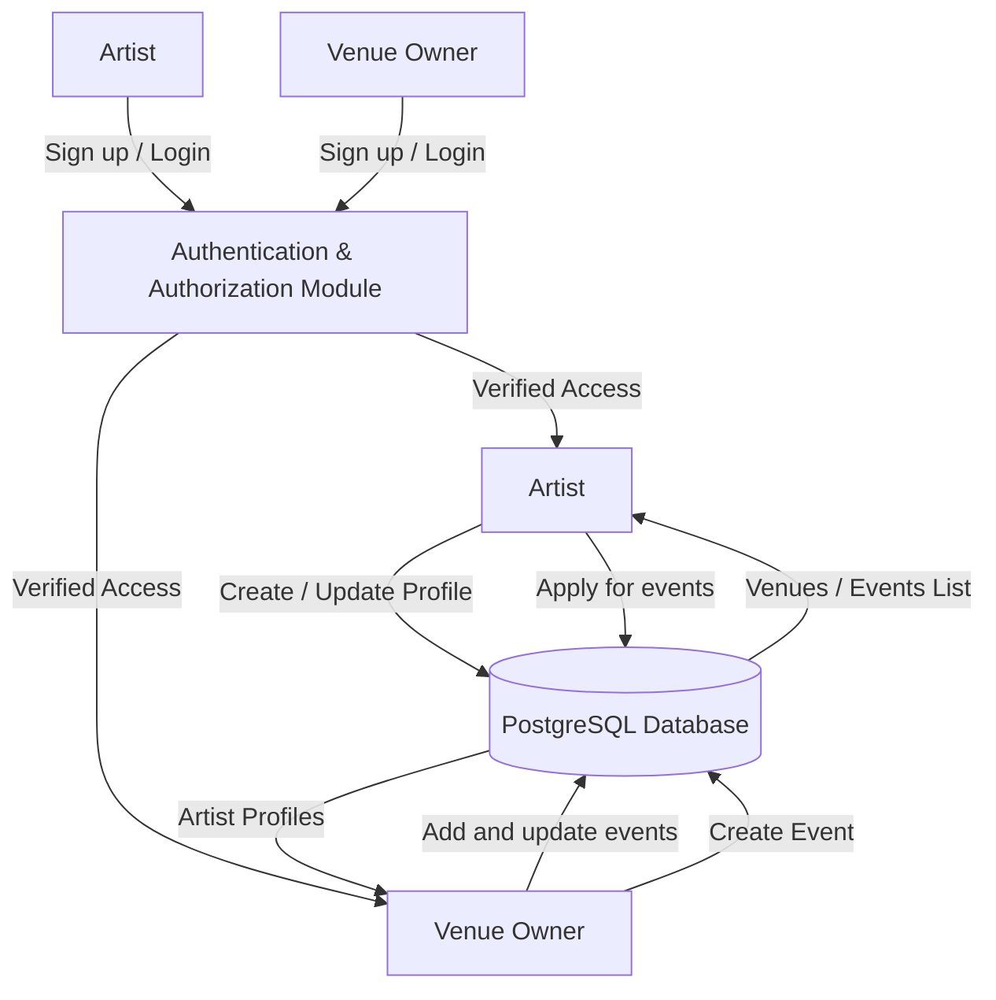

## Data Flow Diagram - Level 0

```mermaid 
flowchart TD

%% ==== EXTERNAL ENTITIES ====
A[Artist]
V[Venue Owner]

%% ==== MAIN SYSTEM ====
S([ArtVenue Platform])

%% ==== DATA FLOWS ====
A -->|Sign Up / Login / View Events / Apply for Events| S
V -->|Sign Up / Login / Create Venue / Create Events | S

S -->|Confirmation Emails| V

```

## Data Flow Diagram - Level 1

```mermaid 
flowchart TD

%% ==== EXTERNAL ENTITIES ====
A[Artist] -->|Sign up / Login | B1[Authentication & Authorization Module]
V[Venue Owner] -->|Sign up / Login | B1

%% ==== MAIN PROCESSES ====
B1 -->|Verified Access| B2[Artist]
B1 -->|Verified Access| B3[Venue Owner]

B2 -->|Create / Update Profile| D[(PostgreSQL Database)]
B2 -->| Apply for events | D[(PostgreSQL Database)]
B3 -->|Add and update events| D

B3 -->|Create Event| D[(PostgreSQL Database)]

%% ==== OUTPUT FLOWS ====
D -->|Venues / Events List| B2
D -->|Artist Profiles | B3


```