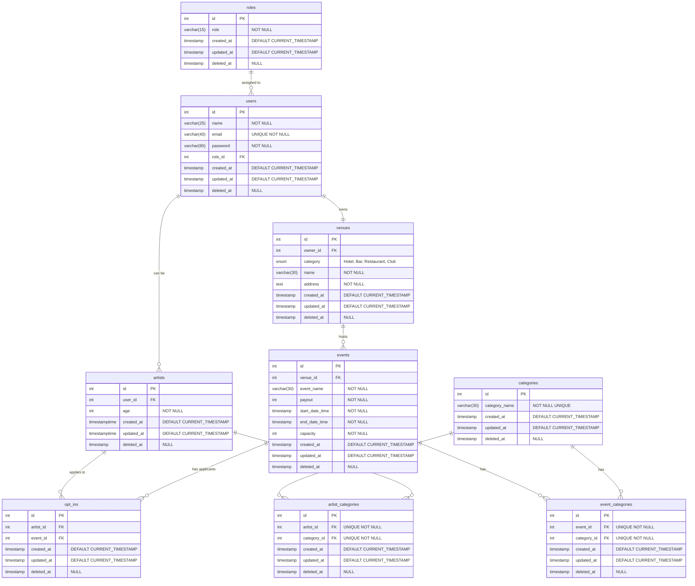

## Entity Relationship Diagram

```mermaid 

    erDiagram

    roles {
        int id PK
        varchar(15) role "NOT NULL"
        timestamp created_at "DEFAULT CURRENT_TIMESTAMP"
        timestamp updated_at "DEFAULT CURRENT_TIMESTAMP"
        timestamp deleted_at "NULL"
    }

    users {
        int id PK
        varchar(25) name "NOT NULL"
        varchar(40) email "UNIQUE NOT NULL"
        varchar(80) password "NOT NULL"
        int role_id FK 
        timestamp created_at "DEFAULT CURRENT_TIMESTAMP"
        timestamp updated_at "DEFAULT CURRENT_TIMESTAMP"
        timestamp deleted_at "NULL"
    }

    artists {
        int id PK
        int user_id FK
        int age "NOT NULL"
        timestamptime created_at "DEFAULT CURRENT_TIMESTAMP"
        timestamptime updated_at "DEFAULT CURRENT_TIMESTAMP"
        timestamp deleted_at "NULL"
    }

    categories {
        int id PK
        varchar(30) category_name "NOT NULL UNIQUE"
        timestamp created_at "DEFAULT CURRENT_TIMESTAMP"
        timestamp updated_at "DEFAULT CURRENT_TIMESTAMP"
        timestamp deleted_at "NULL"
    }

    artist_categories {
        int id PK
        int artist_id FK "UNIQUE NOT NULL"
        int category_id FK "UNIQUE NOT NULL"
        timestamp created_at "DEFAULT CURRENT_TIMESTAMP"
        timestamp updated_at "DEFAULT CURRENT_TIMESTAMP"
        timestamp deleted_at "NULL"
    }

    event_categories {
        int id PK
        int event_id FK "UNIQUE NOT NULL"
        int category_id FK "UNIQUE NOT NULL"
        timestamp created_at "DEFAULT CURRENT_TIMESTAMP"
        timestamp updated_at "DEFAULT CURRENT_TIMESTAMP"
        timestamp deleted_at "NULL"
    }

    venues {
        int id PK
        int owner_id FK
        enum category "Hotel, Bar, Restaurant, Club"
        varchar(30) name "NOT NULL"
        text address "NOT NULL"
        timestamp created_at "DEFAULT CURRENT_TIMESTAMP"
        timestamp updated_at "DEFAULT CURRENT_TIMESTAMP"
        timestamp deleted_at "NULL"
    }

    events {
        int id PK
        int venue_id FK 
        varchar(30) event_name "NOT NULL"
        int payout "NOT NULL"
        timestamp start_date_time "NOT NULL"
        timestamp end_date_time "NOT NULL"
        int capacity "NOT NULL"
        timestamp created_at "DEFAULT CURRENT_TIMESTAMP"
        timestamp updated_at "DEFAULT CURRENT_TIMESTAMP"
        timestamp deleted_at "NULL"
    }

    opt_ins {
        int id PK
        int artist_id FK
        int event_id FK
        timestamp created_at "DEFAULT CURRENT_TIMESTAMP"
        timestamp updated_at "DEFAULT CURRENT_TIMESTAMP"
        timestamp deleted_at "NULL"
    }

    %% Relationships
    roles ||--o{ users : "assigned to"

    venues ||--o{ events : "hosts"
    artists ||--o{ opt_ins : "applies to"
    events ||--o{ opt_ins : "has applicants"
    categories ||--o{ "artist_categories" : "has"
    events ||--o{ "event_categories" : "has"
    categories ||--o{ event_categories : "has"
    artists ||--o{ artist_categories : "has"

    users ||--o{ artists : "can be"
    users ||--|| venues : "owns"   
   

```